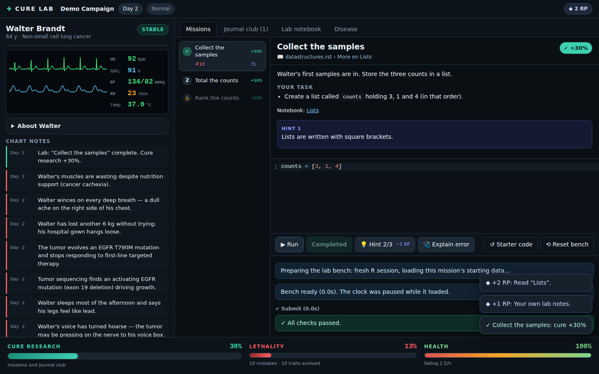
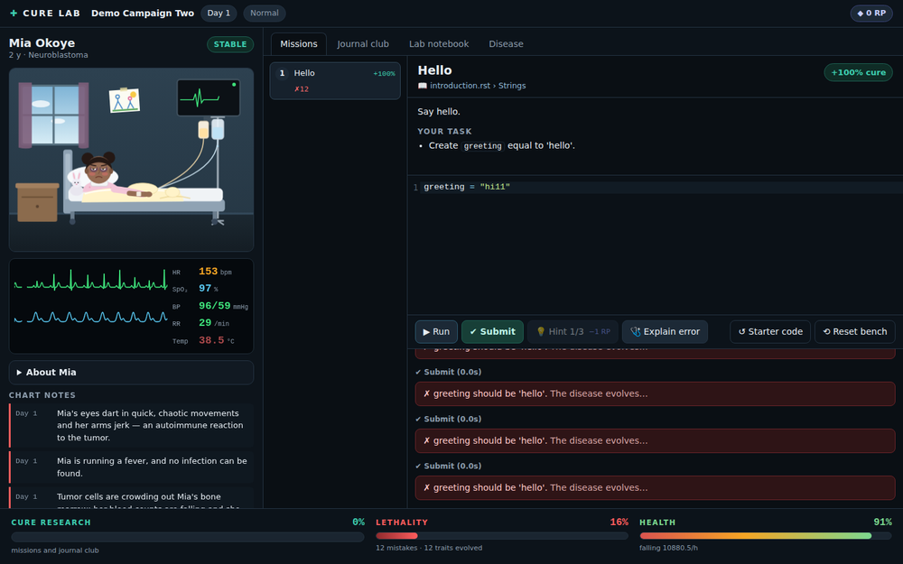
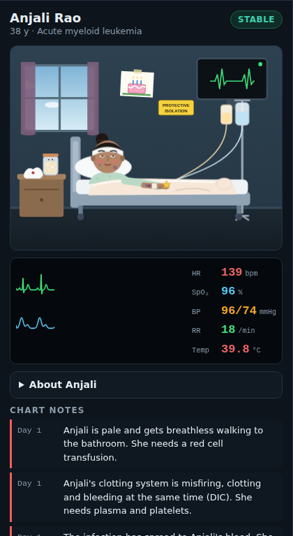
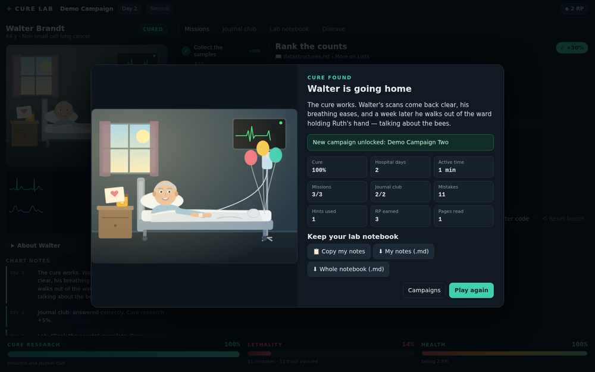

# Cure Lab

**Plague Inc. in reverse, for learning bioinformatics.** A patient is getting
sicker, and your code is the cure. Work through real single-cell analyses in
R. Every correct mission moves the cure forward, and every wrong answer lets
the disease evolve.

The first tool pack teaches **Seurat 5.5.1**. It has three campaigns, each
with its own patient:

| Campaign | Patient | What you learn | Source vignettes |
|---|---|---|---|
| **Seurat Basics** | Walter Brandt, 64: non-small cell lung cancer | Raw 10x counts → QC → normalization → variable genes → scaling → PCA → dimensionality → clustering → UMAP → markers → annotation | `pbmc3k_tutorial` |
| **Seurat for the Multiome Lab** (unlocks after Basics) | Mia Okoye, 2: neuroblastoma | Seurat v5 object anatomy and layers, subsetting, cell-cycle scoring and regression, split layers + Harmony integration, conserved markers, pseudobulk DESeq2, label transfer, merging for co-embedding | `essential_commands`, `cell_cycle_vignette`, `integration_introduction`, `seurat5_integration`, `de_vignette`, `integration_mapping`, `seurat5_atacseq_integration_vignette` |
| **CRISPR Screens with Mixscape** (unlocks after Basics) | Anjali Rao, 38: acute myeloid leukemia | Pooled CRISPR screens read out in single cells (ECCITE-seq): CLR-normalized protein, confounders in RNA clustering, local perturbation signatures (`CalcPerturbSig`), knockout vs non-perturbed calls (`RunMixscape`), guide efficiency, PD-L1 validation, LDA of perturbation responses | `mixscape_vignette` |

Campaign 2 covers the Seurat side of the
[NBL scMultiomics TRN pipeline](https://github.com/wbaopaul/NBL_scMultiomics_Paper/tree/main/TRN-analysis).
[docs/NBL_TRN_READINESS.md](docs/NBL_TRN_READINESS.md) maps each call in those
scripts to the mission that teaches it, and lists what is outside Seurat.

## Quick start

You need Docker (with Compose).

```bash
git clone https://github.com/hanrusun/bioinformatics_tutorial.git
cd bioinformatics_tutorial
docker compose up --build seurat
```

Then open <http://localhost:8000>.

The first build downloads the datasets and runs every mission's reference
solution once. It takes about 45–60 minutes and produces an image of about
5 GB. Later starts are instant. Your progress and lab notebook are kept in a
Docker volume (`curelab-seurat-data`).

The port is bound to `127.0.0.1` on purpose: the game executes the code you
type, so only your own machine can reach it. To skip the Campaign 1
requirement, set `CURELAB_UNLOCK_ALL: "1"` in `docker-compose.yml`.

## How to play



<sub>Screenshots are from the built-in Python demo pack, which exercises the
same engine and UI without needing the R image.</sub>

| Mia's symptoms evolve with every mistake | Anjali, sixteen mistakes in | Cure found |
|---|---|---|
|  |  |  |

- **Cure research**: each coding mission adds 5–11% by complexity, and each
  journal-club question adds 1%. Each campaign totals exactly 100%. Reach it
  while the patient is alive to win.
- **Lethality**: the disease worsens slowly on its own. Every wrong **Submit**
  and every wrong quiz answer makes it evolve a real symptom or mutation from
  the illness's trait tree (a persistent cough, then a pleural effusion, then
  T790M resistance…). The patient's picture, vitals and chart change with
  each one. About one mistake in four instead triggers a random **ward
  event**: Walter starts smoking again, Mia swallows a crayon. Most events
  make things worse; a few (under a quarter) are harmless. You lose if the
  patient's health reaches 0.
- **Run is free, Submit is graded.** Explore as much as you like. The clock
  pauses while your code runs and while the tab is hidden, so reading the docs
  in another tab never costs the patient anything.
- **Research points (RP)** pay for hints, at 1 RP per hint tier. The tiers
  are: concept, then function and arguments, then the verbatim vignette code.
  You earn RP in the **lab notebook**:
  - reading a preloaded page (scroll to the end, then ✓ Read) gives +1 or
    +2 RP;
  - writing your own page of 40+ words gives +1 RP, up to one page per
    mission you have attempted.
- **🩺 Explain error** is always free. It matches your error against common
  R/Seurat mistakes and explains them without giving the answer away.
- **Export** your notebook at any time, or from the end screen: copy your
  notes to the clipboard, or download your notes or the whole notebook
  (reference pages with citations, your notes, the mission log and the
  patient chart) as Markdown.
- **Difficulty**: Casual, Normal or Brutal. This changes how fast the disease
  creeps and how hard each mistake hits.

## Grounded in the official vignettes

Every mission, quiz and notebook page cites a Seurat vignette pinned to the
exact version installed in the image
(`satijalab/seurat@v5.5.1`, [docs/SOURCES.md](docs/SOURCES.md)).
`tools/verify_sources.py` checks, and CI enforces, that:

- every quoted sentence appears **verbatim** in the cited vignette,
- every cited section is a real heading, and
- every line of each mission's reference solution is vignette code.

Five lines are marked as adapted, and the verifier reports them: the local
data path, the learner's own PC choice, and the `obj → ifnb` / `harmony`
names in the Harmony missions.

The hidden checks never hard-code answers. When the image is built,
`packs/seurat/reference/build_reference.R`:

1. runs each verbatim solution,
2. records the expected values,
3. saves the checkpoint the next mission starts from, and
4. asserts that the check accepts the reference solution and rejects a set of
   deliberately wrong ones.

If any check misbehaves, the Docker build fails.

## Architecture

```
engine/            tool-agnostic game server (Python/FastAPI + jupyter_client)
web/               Preact + CodeMirror front end, patient art, vitals monitor
illnesses/         illness + patient definitions (trait trees), one per campaign
packs/seurat/      the Seurat tool pack: missions, quizzes, notebook pages,
                   R helpers, dataset fetcher, reference builder, Dockerfile
tools/             verify_sources.py, simulate_balance.py, rcheck (R code in webR)
docs/              SOURCES (generated), NBL_TRN_READINESS, ADDING_A_TOOL, ART
```

The engine never knows it is running R. It runs learner code in a Jupyter
kernel (IRkernel here), so a future Scanpy or Signac pack swaps in a
different kernel and brings its own illness and patient. See
[docs/ADDING_A_TOOL.md](docs/ADDING_A_TOOL.md).

## Development

You can run everything except the R pack without R or Docker, using the small
Python demo pack at `engine/tests/fixtures/pack_py`:

```bash
python -m venv .venv && . .venv/bin/activate
pip install -e "engine[test]"
(cd web && npm ci && npm run build)
python -m curelab --pack engine/tests/fixtures/pack_py --unlock-all   # http://127.0.0.1:8000
```

For UI work, run `cd web && npm run dev`. It serves on :5173 and proxies
`/api` to :8000.

| Check | Command |
|---|---|
| Engine unit + API tests (real Jupyter kernel) | `pytest engine/tests` |
| Balance targets | `python tools/simulate_balance.py --assert` |
| Vignette grounding (+ regenerates docs/SOURCES.md) | `python tools/verify_sources.py` |
| R code parses; checker helpers and the reference builder tested on a mock pack (webR, no R install needed) | `cd tools/rcheck && npm install && npm test` |
| Web typecheck, unit tests, build | `cd web && npm run typecheck && npm test && npm run build` |
| End-to-end (Playwright, demo pack) | `cd web && npx playwright install chromium && npm run e2e` |
| Everything R, for real | `docker compose build seurat` (runs every solution and check) |

## Balance

All numbers live in [`engine/curelab/balance.yaml`](engine/curelab/balance.yaml).
`simulate_balance.py` plays hundreds of simulated learners against the real
engine and illness trees. On Normal:

- A patient with no mistakes survives about 7 hours of active play.
- A typical learner (about 2 wrong submissions per mission, about 3 hours)
  wins about 98% of the time, with the patient in "serious" condition.
- A reckless player (about 60+ mistakes) loses.

## Art

The patient art is original flat-vector SVG in `web/src/art/`. It includes
breathing, blinking, an ECG and stage-dependent pallor and lighting, plus
overlays for each symptom. You can swap in your own images per patient, per
stage and per symptom, without code changes; see [docs/ART.md](docs/ART.md).

## Credits

Tutorial text and code are quoted from the
[Seurat vignettes](https://satijalab.org/seurat/) (© Satija Lab and
collaborators), pinned to v5.5.1. The datasets come from 10x Genomics,
SeuratData, Nestorowa et al. (2016) and Kang et al. (2018), fetched from the
URLs the vignettes use. The patients are fictional, and the symptom trees
paraphrase public clinical descriptions (NCI PDQ); they are game flavor, not
medical advice. The game mechanics are inspired by *Plague Inc.* (Ndemic
Creations); this project is not affiliated with it.
