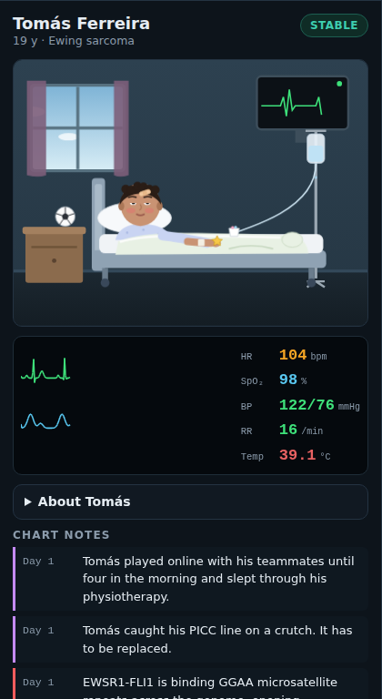

# Cure Lab

**Plague Inc. in reverse, for learning bioinformatics.** A patient is getting
sicker, and your code is the cure. Work through real single-cell analyses in
R. Every correct mission moves the cure forward, and every wrong answer lets
the disease evolve.

There are two tool packs, each in its own Docker image. The **Seurat 5.5.1**
pack has three campaigns, each with its own patient:

| Campaign | Patient | What you learn | Source vignettes |
|---|---|---|---|
| **Seurat Basics** | Walter Brandt, 64: non-small cell lung cancer | Raw 10x counts → QC → normalization → variable genes → scaling → PCA → dimensionality → clustering → UMAP → markers → annotation | `pbmc3k_tutorial` |
| **Seurat for the Multiome Lab** (unlocks after Basics) | Mia Okoye, 2: neuroblastoma | Seurat v5 object anatomy and layers, subsetting, cell-cycle scoring and regression, split layers + Harmony integration, conserved markers, pseudobulk DESeq2, label transfer, merging for co-embedding | `essential_commands`, `cell_cycle_vignette`, `integration_introduction`, `seurat5_integration`, `de_vignette`, `integration_mapping`, `seurat5_atacseq_integration_vignette` |
| **CRISPR Screens with Mixscape** (unlocks after Basics) | Anjali Rao, 38: acute myeloid leukemia | Pooled CRISPR screens read out in single cells (ECCITE-seq): CLR-normalized protein, confounders in RNA clustering, local perturbation signatures (`CalcPerturbSig`), knockout vs non-perturbed calls (`RunMixscape`), guide efficiency, PD-L1 validation, LDA of perturbation responses | `mixscape_vignette` |

The optional **Signac 1.17.1** pack is a separate image that shares the
Seurat image's R base, so you only download and build it if you want it:

| Campaign | Patient | What you learn | Source vignettes |
|---|---|---|---|
| **Chromatin and Regulators** | Tomás Ferreira, 19: Ewing sarcoma | Human 10x multiome (RNA + ATAC in the same cells): a Signac `ChromatinAssay` with hg38 annotations, ATAC QC (nucleosome signal, TSS enrichment), SCTransform and LSI, weighted nearest neighbors, cell-type annotation, coverage plots, peak-to-gene links, JASPAR motifs and chromVAR, ranking the transcription factors of each cell type | Signac `pbmc_multiomic`; Seurat `weighted_nearest_neighbor_analysis` (multiome half) |

Campaign 2 covers the Seurat side of the
[NBL scMultiomics TRN pipeline](https://github.com/wbaopaul/NBL_scMultiomics_Paper/tree/main/TRN-analysis).
[docs/NBL_TRN_READINESS.md](docs/NBL_TRN_READINESS.md) maps each call in those
scripts to the mission that teaches it, and what the Signac pack adds
(chromatin processing, peak-to-gene links, motifs and chromVAR).

## Quick start

You need Docker (with Compose).

```bash
git clone https://github.com/hanrusun/bioinformatics_tutorial.git
cd bioinformatics_tutorial
docker compose up --build seurat
```

Then open <http://localhost:8000>.

The first build downloads the datasets and runs every mission's reference
solution once. On a 4-core machine it takes about 40 minutes and produces an
image of about 9 GB (measured in CI). Later starts are instant. Your progress and lab notebook are kept in a
Docker volume (`curelab-seurat-data`).

For the Signac pack:

```bash
docker compose up --build signac
```

Then open <http://localhost:8001>. Compose first builds the R base that the
Signac image shares with the Seurat one (R, Seurat, and the game's Python and
Jupyter kernel), or reuses it if you have already built Seurat. On top of that
the Signac image adds Signac, the hg38 genome and annotations, the 10x
multiome data and its own reference checkpoints; it doesn't include the Seurat
pack's datasets. It keeps its progress in its own volume
(`curelab-signac-data`), so both games can run side by side.

The port is bound to `127.0.0.1` on purpose: the game executes the code you
type, so only your own machine can reach it. To skip the Campaign 1
requirement, set `CURELAB_UNLOCK_ALL: "1"` in `docker-compose.yml`.

### Updating

```bash
git pull
docker compose up -d --build seurat      # and/or signac
```

Docker reuses every build step whose inputs haven't changed. An update to the
game itself (`engine/` or `web/`) only redoes the last steps of either image,
a few minutes. The long steps (downloading data, running every reference
solution) rerun only when a pack's missions or data scripts change: files in
`illnesses/`, `packs/seurat/` or `packs/signac/`. To see whether an update
touches them, run this before `git pull`:

```bash
git fetch && git diff --stat HEAD @{u} -- illnesses packs
```

Your saved games and notebooks live in Docker volumes, not in the images, so
they carry over. Avoid `docker compose build --no-cache`, `docker builder
prune` and `docker system prune -a`, which throw away the saved build steps
(the next build takes the full time again), and `docker compose down -v`,
which **deletes your saves**. `docker image prune` is safe: it only removes
old, unused images.

### System requirements

Measured in CI on a 4-core Linux machine:

| | Needs |
|---|---|
| Disk | about 9 GB for the image, plus a few GB of scratch space while it builds |
| Build time | about 40 minutes the first time (one Campaign 2 step alone takes 15) |
| RAM to build | about 10 GB: the heaviest mission (the build runs one mission at a time) |
| RAM to play Campaign 1 | about 2 GB for R, plus about 1 GB for the game |
| RAM to play Campaign 2 | about 4 GB for R, plus about 1 GB |
| RAM to play Campaign 3 (Mixscape) | about 9.5 GB for R, plus about 1 GB: the 20,729-cell CRISPR screen |

On Linux, Docker can use all of your RAM. On macOS and Windows, Docker Desktop
runs in a virtual machine with its own memory limit: set **Settings →
Resources → Memory** to at least 12 GB to build the image and play Campaign 3
(6 GB is enough for Campaigns 1 and 2 once the image is built).

The Signac image needs more; see
[Signac pack requirements](#signac-pack-requirements) below.

### Signac pack requirements

Measured in CI:

| | Needs |
|---|---|
| Disk | about 6 GB on top of the R base it shares with the Seurat image: Signac and the hg38 genome and annotations (1.3 GB), the 10x multiome data (2.2 GB) and the reference checkpoints (2.3 GB) |
| Build time | about 50 minutes once the R base is built (it comes with the Seurat image); the chromVAR mission alone takes 20 |
| RAM to build and play | about 12.7 GB for R at the heaviest mission (SCTransform on 10,412 cells), plus about 1 GB for the game. ATAC quality control peaks at 9.6 GB; the other missions at 5 to 8 GB |

The chromVAR mission runs on every CPU core, and its worker processes (not
included above) share most of their memory with the main R process. Give
Docker Desktop at least 14 GB of memory for the Signac pack, which in
practice means a machine with 16 GB of RAM or more (32 GB is comfortable).

## How to play


<sub>Screenshots are from the built-in Python demo pack, which exercises the
same engine and UI without needing the R image.</sub>

| Mia's symptoms evolve with every mistake | Anjali, sixteen mistakes in | Tomás (Signac pack) | Cure found |
|---|---|---|---|
|  |  |  |  |

- **Cure research**: each coding mission adds 5–11% by complexity, and each
  journal-club question adds 1%. Each campaign totals exactly 100%. Reach it
  while the patient is alive to win.
- **Lethality**: the disease worsens slowly on its own. Every wrong **Submit**
  and every wrong quiz answer makes it evolve a real symptom or mutation from
  the illness's trait tree (a persistent cough, then a pleural effusion, then
  T790M resistance…). The patient's picture, vitals and chart change with
  each one. About one mistake in four instead triggers a random **ward
  event**: Walter starts smoking again, Mia swallows a crayon. Most events
  make things worse; a few (under a quarter) are harmless. You lose if the
  patient's health reaches 0. The **Disease** tab lists what has evolved so
  far; traits that haven't happened yet stay hidden unless you press
  **Reveal the whole disease tree**.
- **Journal club**: finishing a mission unlocks its quiz questions; the
  mission list shows how many ("1 quiz") until you answer them.
- **Run is free, Submit is graded.** Explore as much as you like. The clock
  pauses while your code runs and while the tab is hidden, so reading the docs
  in another tab never costs the patient anything.
- **Research points (RP)** pay for hints, at 1 RP per hint tier. The tiers
  are: concept, then function and arguments, then the verbatim vignette code.
  You earn RP in the **lab notebook**:
  - reading a preloaded page (scroll to the end, then ✓ Read) gives +1 or
    +2 RP;
  - writing your own page of 40+ words gives +1 RP, up to one page per
    mission you have attempted.
- **🩺 Explain error** is always free. It matches your error against common
  R/Seurat mistakes and explains them without giving the answer away.
- **💬 Consult another doctor** (optional; free with your Claude plan or
  Gemini's free tier, see [below](#consult-another-doctor-optional)): a
  chatbot colleague you can
  ask anything at any point, from the **Consult** tab or a mission's button.
  It coaches you on the mission you're on without writing its solution, and
  answers anything beyond the game. You can add an answer, or the whole
  conversation, to the lab notebook; those pages earn no RP.
- **💬 Talk to the patient** (same key): a separate chat in which a chatbot
  plays your patient, from the **Talk to …** tab or the button under the
  vitals. Ask "how are you feeling?" and they answer in character, from their
  chart: how ill they are right now and what has happened to them so far.
  Mia, who is two, babbles and sends emojis; her mom is sometimes there to
  chime in. These chats can go into the notebook too, also without RP.
- **Export** your notebook at any time, or from the end screen: copy your
  notes to the clipboard, or download your notes or the whole notebook
  (reference pages with citations, your notes, the mission log and the
  patient chart) as Markdown. **⬇ My mission script** downloads an R script
  with every mission's briefing and task as comments, each followed by the
  code you submitted that passed.
- **Difficulty**: Casual, Normal or Brutal. This changes how fast the disease
  creeps and how hard each mistake hits.

## Consult another doctor (optional)

The **Consult** tab and the **Talk to …** tab (see
[Talk to the patient](#talk-to-the-patient)) connect the game to a chatbot.
They're off until you set one up; everything else works without one.

Pick one option, put its line in a file called `.env` next to
`docker-compose.yml`, then run `docker compose up -d seurat` (or `signac`)
again. `.env` is in `.gitignore`, so it won't be committed.

| Option | Line in `.env` | What it costs |
|---|---|---|
| **Your Claude plan** (Pro, Max or Team) | `CLAUDE_CODE_OAUTH_TOKEN=...` | Nothing extra: it counts against your plan's usage limits |
| **Gemini**, free tier | `GEMINI_API_KEY=...` | Free, within daily limits |
| **ChatGPT** API | `OPENAI_API_KEY=sk-...` | Per message (see [Cost](#cost)) |
| **Claude** API | `ANTHROPIC_API_KEY=sk-ant-...` | Per message |
| **Another OpenAI-compatible service** | `CURELAB_CONSULT_BASE_URL=...` and `CURELAB_CONSULT_MODEL=...` | Depends on the service |

A ChatGPT Plus subscription can't be used by other apps; OpenAI bills its API
separately.

**Your Claude plan.** On any computer with
[Claude Code](https://code.claude.com) installed, run `claude setup-token`,
approve the request in the browser, and copy the token it prints (it's valid
for a year) into `.env`. The game then runs the Claude Code CLI that comes
with Anthropic's Claude Agent SDK inside the container, with no tools and no
files, one answer per message. According to Anthropic,
[Agent SDK use in your own projects](https://support.claude.com/en/articles/15036540-use-the-claude-agent-sdk-with-your-claude-plan)
currently draws from your plan's usage limits; when you reach them, the chat
says so until they reset. It uses your plan's default model; set
`CURELAB_CONSULT_MODEL` to `opus`, `sonnet`, `haiku` or a full model ID to
choose. The token is yours: don't share your `.env` file.

**Gemini's free tier.** Create a key at
[aistudio.google.com](https://aistudio.google.com); no credit card is needed.
The doctor uses `gemini-flash-latest` and the patient
`gemini-flash-lite-latest`, which has a much larger daily quota. The free tier
allows a few requests a minute and a daily number per model (AI Studio shows
your current limits); when you reach one, the chat says so. On the free tier
Google may have people review prompts and responses and use them to improve
its products, and it isn't offered in the EU, Switzerland or the UK (see
[Gemini API terms](https://ai.google.dev/gemini-api/terms_preview)).

**Other services.** Anything that offers OpenAI's chat API works. Set
`CURELAB_CONSULT_BASE_URL`, the model name the service uses in
`CURELAB_CONSULT_MODEL`, and its key, if it needs one, in
`CURELAB_CONSULT_API_KEY`. Some that have free tiers:

- Groq: `https://api.groq.com/openai/v1`
- OpenRouter: `https://openrouter.ai/api/v1` (free models end in `:free`)
- GitHub Models: `https://models.github.ai/inference`, with a GitHub token
  that has the Models permission
- Ollama on your own computer: `http://host.docker.internal:11434/v1`, no
  key. On Linux, start Ollama with `OLLAMA_HOST=172.17.0.1` (Docker's bridge
  address) so the container can reach it.

These run open models, which are fine for the patient's small talk but weaker
at coaching you through Seurat than Claude or ChatGPT.

Optional settings, also in `.env`:

- `CURELAB_CONSULT_PROVIDER` picks one option when several are set:
  `claude-plan`, `gemini`, `openai`, `anthropic` or `custom`. Without it, the
  first one set in this order is used: `OPENAI_API_KEY`, `ANTHROPIC_API_KEY`,
  `CLAUDE_CODE_OAUTH_TOKEN`, `GEMINI_API_KEY`, `CURELAB_CONSULT_BASE_URL`.
- `CURELAB_CONSULT_MODEL` sets the doctor's model. The defaults are
  `gpt-6-astra` for ChatGPT, `claude-opus-5-5` for the Claude API, your plan's
  default for your Claude plan, and `gemini-flash-latest` for Gemini.
- `CURELAB_BEDSIDE_MODEL` sets the patient's model, for example a cheaper one.
  It defaults to the doctor's, and to `gemini-flash-lite-latest` on Gemini.
- `CURELAB_CONSULT_EFFORT` and `CURELAB_BEDSIDE_EFFORT` set how hard each
  chat's model thinks before answering. More effort gives more careful answers
  but is slower and, on the APIs, costs more. On Claude (API or plan) they
  default to `medium` for the doctor and `low` for the patient, and accept
  `low`, `medium`, `high`, `xhigh` or `max`. On ChatGPT, Gemini and other
  services nothing is sent unless you set one; it is then passed on as
  `reasoning_effort`, and the values each model accepts differ (for example
  `minimal`, `low`, `medium`, `high`). If a model rejects the value, the chat
  shows the service's message.

For example, a `.env` for your Claude plan with a careful doctor and a quick,
cheaper patient:

```
CLAUDE_CODE_OAUTH_TOKEN=sk-ant-oat01-...
CURELAB_CONSULT_MODEL=opus
CURELAB_CONSULT_EFFORT=high
CURELAB_BEDSIDE_MODEL=haiku
CURELAB_BEDSIDE_EFFORT=low
```

Each chat's header shows the model and effort it's using.

You can also change them in the game, without touching `.env` or restarting:
**⚙ Model & effort** in each chat's header offers the models your service
has (or type any model name) and its effort levels. Those choices override
`.env`, are saved with your profile, and apply from the next message; **Reset
to defaults** goes back to `.env`. The key or token itself can only be set in
`.env`, because the browser never sees it.

On the Claude API, the game turns on Anthropic's server-side refusal fallback:
if a question is declined, the API retries it on another Claude model.

**What is sent.** With each question the game sends your question, the
earlier turns of the conversation, the tool versions, which missions you've
finished, and, when a mission is selected, its briefing, task and cited
vignette section. It also sends your current code and last error unless you
untick "share my code and last error". It never sends a mission's reference
solution, the hidden checks, the expected answers, your notebook, or your key
or token. Those stay in the game server, and the browser only learns which
service and models are active. Your messages go to the service you chose,
under its terms.

### Cost

The chats are free in the game (no RP), and the clock keeps running while you
use them. What the service charges, estimated from what the game sends:

| Option | A question to the doctor | A message to the patient |
|---|---|---|
| Your Claude plan | nothing extra | nothing extra |
| Gemini, free tier | free | free |
| Claude API (`claude-opus-5-5`) | about 2–7 US cents | about 1 cent |
| ChatGPT API (`gpt-6-astra`) | about 5–17 cents | about 1–3 cents |

Most of the cost is the answer (including the model's hidden reasoning, which
is billed as output). The provider's console shows the exact cost of each
request, and you can set a monthly spending limit there.

### Talk to the patient

The same setup also runs a second, separate chat: the **Talk to …** tab,
named after your patient. A chatbot plays the patient, using their background from
the illness file and, with each message, a short chart built from the game:
the day, how ill they are now, the symptoms and ward events so far, and
roughly how the research is going. They answer as a patient would. They don't
know about the lab work, and they never see numbers or game mechanics.
Patients under five babble, sending a word or two and emojis, and the
family member who is sometimes at the bedside may add a line. After a loss
the chat closes but stays readable. On Claude it runs at low effort, since
answers are short. It's free in the game and the clock keeps running; with
each message, only your words, the earlier turns and that chart are sent.

## Grounded in the official vignettes

Every mission, quiz and notebook page cites a vignette pinned to the exact
version installed in the image: `satijalab/seurat@v5.5.1` for the Seurat pack
([docs/SOURCES.md](docs/SOURCES.md)), and `stuart-lab/signac@1.17.1` plus the
Seurat WNN vignette for the Signac pack
([docs/SOURCES-signac.md](docs/SOURCES-signac.md)).
`tools/verify_sources.py` checks, and CI enforces, that:

- every quoted sentence appears **verbatim** in the cited vignette,
- every cited section is a real heading, and
- every line of each mission's reference solution is vignette code.

Five lines in the Seurat pack are marked as adapted, and the verifier
reports them: the local data path, the learner's own PC choice, and the
`obj → ifnb` / `harmony` names in the Harmony missions. The Signac pack
adapts five: the paths to the multiome files in the image, and three cluster
numbers in the annotation mission. In this build, clusters 8, 9 and 11 come
out in a different order than in the vignette's own run, so its labels
would call monocytes "CD8 Naive". The annotation check therefore also tests
every cluster's label against its marker genes.

The hidden checks never hard-code answers. When an image is built,
`packs/seurat/reference/build_reference.R` (which also builds the Signac pack):

1. runs each verbatim solution,
2. records the expected values,
3. saves the checkpoint the next mission starts from, and
4. asserts that the check accepts the reference solution and rejects a set of
   deliberately wrong ones.

If any check misbehaves, the Docker build fails.

## Architecture

```
engine/            tool-agnostic game server (Python/FastAPI + jupyter_client)
web/               Preact + CodeMirror front end, patient art, vitals monitor
illnesses/         illness + patient definitions (trait trees), one per campaign
packs/seurat/      the Seurat tool pack: missions, quizzes, notebook pages,
                   R helpers, dataset fetcher, reference builder, Dockerfile
packs/signac/      the Signac tool pack (image built FROM the Seurat one;
                   reuses its helpers and reference builder)
tools/             verify_sources.py, simulate_balance.py, rcheck (R code in webR)
docs/              SOURCES (generated), NBL_TRN_READINESS, ADDING_A_TOOL, ART
```

The engine never knows it is running R. It runs learner code in a Jupyter
kernel (IRkernel here), so a future Scanpy pack swaps in a different kernel
and brings its own illness and patient. A pack can cite several pinned
source repositories (the Signac pack cites Signac's and Seurat's vignettes). See
[docs/ADDING_A_TOOL.md](docs/ADDING_A_TOOL.md).

## Development

You can run everything except the R pack without R or Docker, using the small
Python demo pack at `engine/tests/fixtures/pack_py`:

```bash
python -m venv .venv && . .venv/bin/activate
pip install -e "engine[test]"
(cd web && npm ci && npm run build)
python -m curelab --pack engine/tests/fixtures/pack_py --unlock-all   # http://127.0.0.1:8000
```

For UI work, run `cd web && npm run dev`. It serves on :5173 and proxies
`/api` to :8000.

| Check | Command |
|---|---|
| Engine unit + API tests (real Jupyter kernel) | `pytest engine/tests` |
| Balance targets | `python tools/simulate_balance.py --assert` |
| Vignette grounding (+ regenerates docs/SOURCES.md) | `python tools/verify_sources.py` |
| Same for the Signac pack (+ docs/SOURCES-signac.md) | `python tools/verify_sources.py --pack packs/signac` |
| R code parses; checker helpers and the reference builder tested on a mock pack (webR, no R install needed) | `cd tools/rcheck && npm install && npm test` |
| Web typecheck, unit tests, build | `cd web && npm run typecheck && npm test && npm run build` |
| End-to-end (Playwright, demo pack) | `cd web && npx playwright install chromium && npm run e2e` |
| Everything R, for real | `docker compose build seurat` (runs every solution and check) |
| Everything R for the Signac pack | `docker compose --profile signac build signac` |

## Balance

All numbers live in [`engine/curelab/balance.yaml`](engine/curelab/balance.yaml).
`simulate_balance.py` plays hundreds of simulated players against the real
engine and illness trees. They are made-up profiles, not measurements of real
learners. Health declines at twice the original rate (`h_max_per_hour: 300`).
On Normal:

- A patient with no mistakes survives about 5.5 hours of counted play (the
  clock only runs while the tab is visible and no code is running).
- The simulated "typical" player (about 30 wrong submissions and quiz
  answers over 2.5 hours of counted play) wins about 40–60% of games.
- The simulated reckless player (about 50 mistakes) always loses.

Real sessions are usually shorter and gentler than that. Health falls with
the square of lethality, so early mistakes barely show: an hour of counted
play with 10 mistakes leaves the patient at about 96% health (98% before
the decline was doubled).

## Art

The patient art is original flat-vector SVG in `web/src/art/`. It includes
breathing, blinking, an ECG and stage-dependent pallor and lighting, plus
overlays for each symptom. You can swap in your own images per patient, per
stage and per symptom, without code changes; see [docs/ART.md](docs/ART.md).

## Credits

Tutorial text and code are quoted from the
[Seurat vignettes](https://satijalab.org/seurat/) (© Satija Lab and
collaborators), pinned to v5.5.1, and the
[Signac vignettes](https://stuartlab.org/signac/) (© Stuart Lab), pinned to
1.17.1. The datasets come from 10x Genomics, SeuratData, Nestorowa et al.
(2016), Kang et al. (2018) and Papalexi et al. (2021), fetched from the URLs
the vignettes use; motifs come from JASPAR 2020. The patients are fictional, and the symptom trees
paraphrase public clinical descriptions (NCI PDQ); they are game flavor, not
medical advice. The game mechanics are inspired by *Plague Inc.* (Ndemic
Creations); this project is not affiliated with it.
